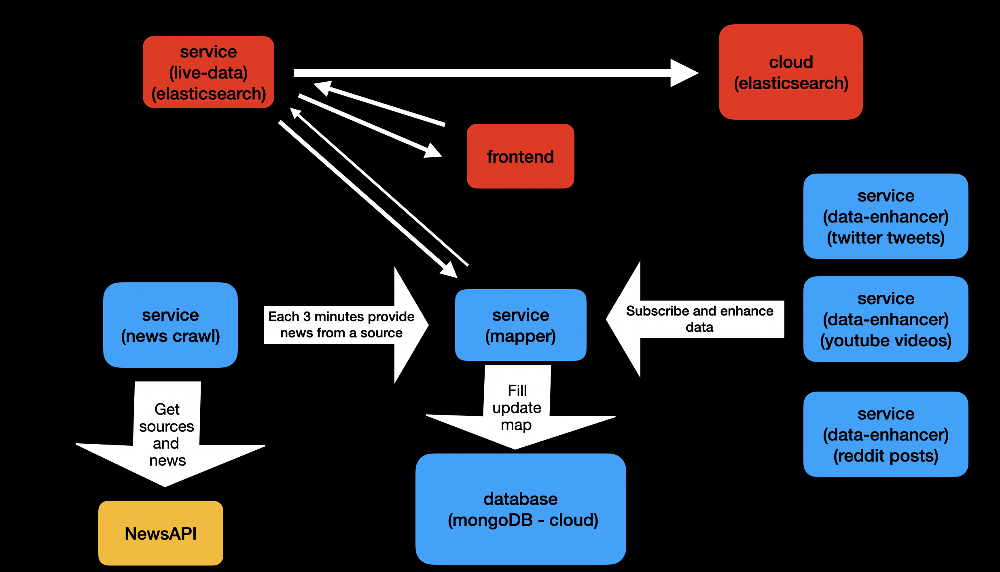

# Elasticsearch by Project

- Frontend live link: `https://news-feed-es.netlify.app/`



- This project is the product of the virtual internship at Elastic to learn the Elasticsearch from by practice.
  I was mentored by two senior developers from the Elastic throughout the internship phase.

- Project consists of 6 services and a frontend client. Services are;

1. **Mapper**; the micro-service which acts as a coordinator between other services and the state (mongoDB database),
2. **News-service**; the micro-service which fetches the sources and the news from the News API by the control of the mapper service,
3. **Data-services**; three data-services which are responsible for enhancing the base news with extra data; youtube video data, reddit post data, twitter tweets data,
4. **Elastic-service**; the micro-service which interacts with Elasticsearch cloud instance and organize CRUD operations. This service is also the main data provider to the frontend.
5. **Frontend**; the single page application which is written with React.

- The services and the frontend are written with TypeScript.

## Instructions

- Before trying to run the projects make sure that you have `node` and `npm` installed;

  - if you do not have them follow the [link](https://nodejs.org/en/download/).

- And run `npm install` first to download required node-modules.

1. To run the services locally cd into the related services directory and run: `npm run start:dev`
2. Each service requires some env variables to be set;

- For elastic service, you should provide elastic cloud id, username and password. This can be created from the [Elastic](https://www.elastic.co/) website for 14 days as free.
- For mapper service, you should provide a username, password and db name from the mongodb cloud. This can be created from the [mongodb cloud website](https://www.mongodb.com/) for free.
- For news service; you should provide a news api key which is also free and can be created from the [News API website](https://newsapi.org/).
- For twitter service; you should provide an api key, api secret and bearer token which are free to create from [Twitter developers account](https://developer.twitter.com/).
- For youtube service; you should provide google api key. If you have multiple keys, you can join them with commas and the service will use them accordingly. The key can be created from the [Google Developers console](https://console.developers.google.com/).

3. To run the frontend locally;

```
cd frontend
npm run start
```

- Frontend project has the running elastic service url as env variable already set and can be used easily.
